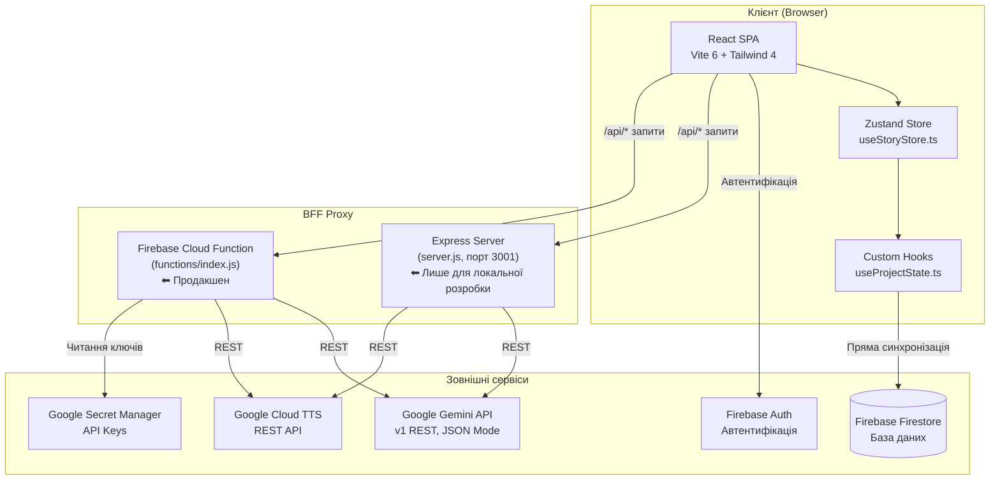

# 📘 WhiteWrite — Повна база знань проекту

> **Дата створення документа:** 25 травня 2026
> **Автор:** Antigravity AI (на основі повного аудиту кодової бази)
> **Репозиторій:** [github.com/Aizekhan/White-Tree](https://github.com/Aizekhan/White-Tree)
> **Продакшен-сайт:** [whitewrite.com](https://whitewrite.com)
> **Назва пакету:** `whitewrite`
> **Локальна робоча директорія:** `E:\White Tree`

---

## 📋 Зміст

1. [Що таке WhiteWrite](#1-що-таке-whitewrite)
2. [Технологічний стек](#2-технологічний-стек)
3. [Архітектура системи](#3-архітектура-системи)
4. [Файлова структура проекту](#4-файлова-структура-проекту)
5. [Зовнішні сервіси та API](#5-зовнішні-сервіси-та-api)
6. [Робота зі штучним інтелектом (Gemini)](#6-робота-зі-штучним-інтелектом-gemini)
7. [Google Cloud Text-to-Speech (TTS)](#7-google-cloud-text-to-speech-tts)
8. [Firebase — автентифікація та база даних](#8-firebase--автентифікація-та-база-даних)
9. [Система збереження даних (Save Queue)](#9-система-збереження-даних-save-queue)
10. [Керування станом (Zustand Store)](#10-керування-станом-zustand-store)
11. [Типізація та моделі даних](#11-типізація-та-моделі-даних)
12. [Робочий процес розробника](#12-робочий-процес-розробника)
13. [Деплой та хостинг](#13-деплой-та-хостинг)
14. [Git та GitHub](#14-git-та-github)
15. [Виявлені та виправлені проблеми](#15-виявлені-та-виправлені-проблеми)
16. [Відомі нюанси та підводні камені](#16-відомі-нюанси-та-підводні-камені)
17. [Корисні команди](#17-корисні-команди)

---

## 1. Що таке WhiteWrite

**WhiteWrite** — це професійний веб-інструмент для письменників, який поєднує текстовий редактор із потужним ШІ-помічником на базі Google Gemini. Додаток дозволяє:

- **Писати** — генерувати нові сцени та продовжувати історію з урахуванням контексту та наративної пам'яті.
- **Аналізувати** — отримувати глибокий діагностичний аналіз тексту: оцінки за 6 критеріями (сюжет, персонажі, конфлікт, атмосфера, діалоги, стиль), аналіз напруги, структуру історії, граф зв'язків між сутностями.
- **Покращувати** — автоматично переписувати слабкі ділянки тексту зі збереженням оригінального голосу автора.
- **Адаптувати** — конвертувати текст у сценарій, картки для коротких відео, дитячу книжку, вірш або пост у соцмережі.
- **Архітектурувати** — створювати повну структуру твору (3 акти, розділи, сцени) з однієї ідеї.
- **Слухати** — озвучувати написаний текст через Google Cloud TTS (українською та іншими мовами).

Додаток підтримує **українську та англійську** мови для генерації контенту, має систему **наративної пам'яті** (персонажі, локації, хронологія, правила світу, ключові події) та **систему проектів** із автозбереженням у хмарі.

---

## 2. Технологічний стек

### Frontend
| Технологія | Версія | Призначення |
|---|---|---|
| **React** | 19.0.0 | UI-фреймворк |
| **TypeScript** | ~5.8.2 | Типізація |
| **Vite** | ^6.2.0 | Збірка, dev-сервер, HMR |
| **Tailwind CSS** | ^4.1.14 | Стилізація (через `@tailwindcss/vite` плагін) |
| **Zustand** | ^5.0.12 | Глобальне керування станом |
| **Motion** | ^12.23.24 | Анімації (Framer Motion) |
| **D3.js** | ^7.9.0 | Візуалізація графів зв'язків (Story Map) |
| **Lucide React** | ^0.546.0 | Іконки |
| **React Markdown** | ^10.1.0 | Рендер markdown-тексту |
| **clsx + tailwind-merge** | — | Утилітарне об'єднання CSS-класів |

### Backend
| Технологія | Версія | Призначення |
|---|---|---|
| **Node.js** | 22 | Середовище виконання Cloud Functions |
| **Express** | — | Локальний BFF-проксі сервер |
| **Firebase Admin SDK** | ^13.7.0 | Серверна автентифікація та Firestore |
| **Firebase Functions v2** | ^7.2.2 | Хмарні функції (Cloud Run) |

### Інфраструктура
| Сервіс | Призначення |
|---|---|
| **Firebase Auth** | Автентифікація користувачів |
| **Firebase Firestore** | NoSQL база даних для проектів |
| **Firebase Hosting** | Хостинг статичних файлів фронтенду |
| **Google Cloud Run** | Хостинг хмарних функцій |
| **Google Secret Manager** | Зберігання API-ключів у продакшені |
| **Google Gemini API (v1 REST)** | Генерація та аналіз тексту |
| **Google Cloud TTS API** | Синтез мовлення |
| **GitHub** | Контроль версій та зберігання коду |
| **Vercel** | Альтернативний хостинг (налаштований, але основний — Firebase) |

---

## 3. Архітектура системи

Проект побудований як **SPA (Single Page Application)** із проміжним серверним шаром **BFF (Backend for Frontend)**.



### Потік даних запиту до ШІ:
1. Користувач натискає кнопку генерації у фронтенді.
2. Фронтенд формує промпт із контекстом сцени + наративною пам'яттю (з `Zustand store`).
3. Запит відправляється на `/api/ai/generate` з Firebase Auth ID-токеном у заголовку `Authorization: Bearer <token>`.
4. BFF перевіряє токен через Firebase Admin SDK.
5. BFF надсилає промпт до Gemini API v1 REST з `responseMimeType: "application/json"`.
6. Відповідь парситься через `safeParseJSON` (4 рівні відновлення).
7. Структурований JSON повертається фронтенду.
8. Фронтенд оновлює стан у Zustand → запускає автозбереження у Firestore.

---

## 4. Файлова структура проекту

```
E:\White Tree\
├── .env                          # Локальні змінні середовища (НЕ коммітиться)
├── .env.example                  # Шаблон змінних середовища
├── .firebaserc                   # Конфіг Firebase-проекту (white-tree-489715)
├── .gitignore                    # Правила ігнорування Git
├── README.md                     # Загальний README
├── README_TECHNICAL.md           # Технічний гайд розробника
├── firebase.json                 # Конфіг Firebase Hosting + Functions + Firestore
├── firestore.rules               # Правила безпеки Firestore
├── index.html                    # Точка входу HTML
├── metadata.json                 # Метадані додатку (назва, опис)
├── package.json                  # NPM залежності та скрипти
├── package-lock.json             # Lock-файл залежностей
├── server.js                     # Локальний Express BFF-проксі (порт 3001)
├── tmp_check_models.js           # Тимчасовий скрипт перевірки моделей
├── tsconfig.json                 # Конфіг TypeScript
├── vercel.json                   # Конфіг деплою на Vercel
├── vite.config.ts                # Конфіг збірки Vite
│
├── assets/
│   └── logo.png                  # Логотип WhiteWrite
│
├── functions/                    # Firebase Cloud Functions (Backend)
│   ├── index.js                  # Головна хмарна функція "api"
│   ├── package.json              # Залежності Cloud Functions
│   ├── package-lock.json
│   ├── list-models.js            # Утиліта: список доступних моделей Gemini
│   ├── ping-models.js            # Утиліта: тестування моделей
│   ├── models.txt                # Результати list-models
│   └── ping_results.txt          # Результати ping-models
│
└── src/                          # Вихідний код фронтенду
    ├── App.tsx                   # Головний компонент додатку (~46KB, монолітний)
    ├── main.tsx                  # Точка входу React
    ├── index.css                 # Глобальні стилі
    ├── types.ts                  # Усі TypeScript типи та інтерфейси
    ├── translations.ts           # Переклади UI (UA/ENG)
    ├── firebase.ts               # Ініціалізація Firebase SDK
    ├── vite-env.d.ts             # Типізація Vite
    │
    ├── config/
    │   ├── apiConfig.ts          # API_BASE_URL + getAuthToken() з retry-логікою
    │   ├── storyEngineConfig.ts  # Конфіги наративного двигуна
    │   └── subscription.ts       # Конфіги підписок/тарифів
    │
    ├── hooks/
    │   ├── useProjectState.ts    # Головний хук синхронізації проектів із Firestore
    │   ├── useAudioReading.ts    # Хук для TTS (озвучення тексту)
    │   └── useSubscription.ts    # Хук перевірки підписки
    │
    ├── services/
    │   └── AIEngine.ts           # Сервіс взаємодії з ШІ (~52KB, усі промпти та схеми)
    │
    ├── store/
    │   └── useStoryStore.ts      # Zustand store (глобальний стан)
    │
    └── features/
        ├── auth/components/
        │   └── Login.tsx                   # Сторінка входу
        ├── projects/components/
        │   └── ProjectList.tsx             # Список проектів
        ├── story/components/
        │   ├── NarrativeWorkspace.tsx       # Робочий простір редактора
        │   ├── StoryArchitectureView.tsx    # Перегляд структури історії (3 акти)
        │   ├── StoryMap.tsx                 # D3.js граф зв'язків
        │   └── WorkflowBar.tsx             # Панель режимів (Write/Analyze/Improve/Adapt)
        ├── analysis/components/
        │   ├── AnalysisResultsPanel.tsx     # Панель результатів аналізу
        │   ├── AnalysisSubPanels.tsx        # Підпанелі аналізу (напруга, теми, тощо)
        │   ├── AIComparisonView.tsx         # Порівняння оригіналу з покращеним текстом
        │   └── EngineLogicPanel.tsx         # Панель логів ШІ-двигуна
        ├── memory/components/
        │   └── NarrativeMemoryPanel.tsx     # Панель наративної пам'яті
        └── shared/components/
            ├── AppHeader.tsx               # Хедер із індикатором збереження
            ├── AudioPlayer.tsx             # Аудіоплеєр (TTS)
            └── SubscriptionGate.tsx        # Гейт підписки (обмеження функцій)
```

---

## 5. Зовнішні сервіси та API

### Перелік усіх сервісів:
| Сервіс | Призначення | Ключ / Секрет |
|---|---|---|
| **Google Gemini API** | Генерація та аналіз тексту | `GEMINI_API_KEY` (Secret Manager) / `VITE_GEMINI_API_KEY` (локально) |
| **Google Cloud TTS** | Синтез мовлення (Text-to-Speech) | `GOOGLE_TTS_API_KEY` (Secret Manager) / `VITE_GOOGLE_TTS_API_KEY` (локально) |
| **Firebase Auth** | Автентифікація (email/password, Google) | `VITE_FIREBASE_API_KEY` |
| **Firebase Firestore** | Зберігання проектів | Через Firebase Admin SDK |
| **Firebase Hosting** | Хостинг фронтенду | Через `firebase deploy` |
| **Google Secret Manager** | Зберігання секретів у хмарі | Через Firebase Functions secrets |
| **GitHub** | Контроль версій | Через SSH/HTTPS |

### Firebase Project:
- **Project ID:** `white-tree-489715`
- **Auth Domain:** `white-tree-489715.firebaseapp.com`
- **Storage Bucket:** `white-tree-489715.firebasestorage.app`
- **App ID:** `1:306095572158:web:8726bbf673a17d91250aef`
- **Measurement ID:** `G-94BED6GFC4`

---

## 6. Робота зі штучним інтелектом (Gemini)

### Версія та модель
- **API Version:** `v1` (стабільна)
- **Модель:** Динамічна, береться з `process.env.GEMINI_MODEL`
- **Дефолтна модель:** `gemini-2.5-flash`
- **Endpoint:** `https://generativelanguage.googleapis.com/v1/models/{model}:generateContent`

### Режими роботи ШІ (NarrativeMode):
| Режим | Опис | Що повертає |
|---|---|---|
| **Write** | Генерація нової сцени або продовження тексту | `improvedText` + `memorySuggestions` |
| **Analyze** | Повний діагностичний аналіз тексту | `score`, `detailedScores`, `strengths`, `weaknesses`, `tensionAnalysis`, `storyMap`, тощо |
| **Improve** | Покращення стилю, пейсингу та емоційного впливу | `improvedText` + `editorSuggestions` + `memorySuggestions` |
| **Adapt** | Конвертація у сценарій, вірш, пост, дитячу книжку | `improvedText` + `script` (для сценаріїв) |
| **Architect** | Генерація повної структури твору з ідеї | `architecture` (3 акти) + `storyMap` |

### Стратегія "Double Prompt" (Legacy Style)
У REST-запитах використовується масив `parts` в одному повідомленні:
```json
{
  "contents": [{
    "role": "user",
    "parts": [
      { "text": "СИСТЕМНА ІНСТРУКЦІЯ..." },
      { "text": "Ось текст користувача...\n\nВиконай завдання..." }
    ]
  }]
}
```
Це імітує розділення на System/User prompt, що дає моделі подвійний фокус на контексті.

### 4-рівневий парсер JSON (`safeParseJSON`)
Реалізований у хмарній функції [functions/index.js](file:///e:/White%20Tree/functions/index.js):
1. **Рівень 1:** Стандартний `JSON.parse()`.
2. **Рівень 2:** Пошук останньої `}` (якщо відповідь обрізана).
3. **Рівень 3:** Автоматичне закриття незавершених дужок/лапок.
4. **Рівень 4:** Повернення `{ rawText, parseError: true }` — сервер **ніколи не падає**.

### Фільтрація наративної пам'яті
Перед відправкою промпту до ШІ, система фільтрує наративну пам'ять, залишаючи тільки:
- Персонажів, чиї імена або локації згадуються в контексті активної сцени.
- Локації, пов'язані з цими персонажами.
- Останні 5 сюжетних подій.
- Правила світу, пов'язані з поточними локаціями.

Це оптимізує розмір промпту та зменшує витрати токенів.

---

## 7. Google Cloud Text-to-Speech (TTS)

- **Endpoint:** `https://texttospeech.googleapis.com/v1/text:synthesize`
- **Мова за замовчуванням:** `uk-UA` (українська)
- **Голос за замовчуванням:** `uk-UA-Wavenet-A`
- **Формат аудіо:** MP3
- **Маршрут BFF:** `POST /api/tts`
- **Потік:** Текст → BFF проксі → Google TTS API → base64 аудіо → бінарний MP3 → клієнт

---

## 8. Firebase — автентифікація та база даних

### Автентифікація (Firebase Auth)
- Використовується для входу користувачів та генерації **ID-токенів**.
- Токени передаються в заголовку `Authorization: Bearer <token>` для всіх запитів до BFF.
- Функція `getAuthToken()` у [apiConfig.ts](file:///e:/White%20Tree/src/config/apiConfig.ts) має **retry-логіку** (3 спроби з затримкою 1 сек.) для обробки ситуації, коли `auth.currentUser` ще не ініціалізований на першому рендері.
- **Адмін-обхід:** Для email `hrytsenkomaksym@gmail.com` автоматично встановлюється тариф `pro_plus`.

### Firestore (База даних)
- **Колекція:** `projects`
- **Документ:** Один документ = один проект користувача
- **Правила безпеки** ([firestore.rules](file:///e:/White%20Tree/firestore.rules)):
  ```
  match /projects/{projectId} {
    allow read, write: if request.auth != null && request.auth.uid == resource.data.userId;
    allow create: if request.auth != null && request.resource.data.userId == request.auth.uid;
  }
  ```
  Користувач має доступ виключно до своїх документів. Усе інше — заборонено за замовчуванням.

### Структура документа проекту в Firestore:
```typescript
{
  id: string;
  userId: string;
  title: string;
  description: string;
  language: 'UA' | 'ENG';
  tier: 'free' | 'pro_plus';
  tokens: number;
  text: string;                    // Поточний текст у редакторі
  memory: NarrativeMemory;         // Персонажі, локації, хронологія, правила, події
  sceneProgress: Record<string, Status>;  // Статус кожної сцени
  architecture: StoryArchitecture | null; // Структура твору (3 акти)
  result: AnalysisResult | null;   // Останній результат аналізу
  activeScene: { ... } | null;     // Активна сцена
  engineLogs: EngineLog[];         // Логи ШІ-двигуна
  createdAt: Timestamp;
  updatedAt: Timestamp;
}
```

---

## 9. Система збереження даних (Save Queue)

Одна з найважливіших підсистем проекту. Реалізована в [useStoryStore.ts](file:///e:/White%20Tree/src/store/useStoryStore.ts) та [useProjectState.ts](file:///e:/White%20Tree/src/hooks/useProjectState.ts).

### Потік даних:
```
User Action → Update Zustand Store → structuredClone(Snapshot) → Enqueue(Queue) → Firestore Write → Clear isDirty
```

### Гарантії:
1. **Zero Race Conditions:** Завдяки `saveQueue` (ланцюжок промісів) запити обробляються строго один за одним.
2. **Snapshot Integrity:** У Firestore передається `structuredClone()` даних на момент дії, а не живий об'єкт.
3. **Skip Obsolete:** Якщо з'явилась новіша версія, старі знімки автоматично пропускаються.
4. **Blocking Switch:** При перемиканні проекту система чекає завершення активного збереження.

### Таймери автозбереження:
| Тригер | Затримка | Опис |
|---|---|---|
| Зміна тексту (`text`) | 800 мс | Автозбереження після набору тексту |
| Зміна пам'яті (`memory`) | 400 мс | Автозбереження після оновлення наративної пам'яті |
| Будь-яка зміна (`isDirty`) | 3000 мс | Загальний catch-all таймер |

### Захист від збереження під час завантаження:
- Прапорець `isHydrating` запобігає збереженню під час початкового завантаження проекту з Firestore.
- Прапорець `isProjectLoaded` гарантує, що збереження відбувається тільки після повної гідрації стану.

### Діагностика:
- **Консоль (F12):** Логи з префіксом `[SAVE_QUEUE]`.
- **Zustand State:** Поля `currentSaveVersion`, `isSaving`, `isDirty`.
- **UI Індикатор:** У хедері відображається статус: `idle` / `saving` / `saved` / `error`.

---

## 10. Керування станом (Zustand Store)

Файл: [useStoryStore.ts](file:///e:/White%20Tree/src/store/useStoryStore.ts)

### Основні категорії стану:

**Проект:**
- `projects` — масив усіх проектів користувача
- `activeProjectId` — ID активного проекту
- `isInitialLoad` — чи це перше завантаження

**Редактор:**
- `text` — поточний текст у редакторі
- `architecture` — структура історії (3 акти, розділи, сцени)
- `result` — останній результат аналізу/генерації
- `localResult` / `localIsAnalyzing` — локальний стан аналізу
- `activeScene` — активна сцена (акт, розділ, сцена, цілі, конфлікти)
- `workflowPhase` — фаза: `blueprint` або `editor`
- `sceneProgress` — прогрес кожної сцени (Planned/Drafted/Analyzed/Improved/Adapted)

**Користувач:**
- `tokens` — баланс токенів
- `memory` — наративна пам'ять
- `engineLogs` — логи ШІ-двигуна

**Синхронізація:**
- `saveStatus`, `isSaving`, `isDirty`, `saveQueue`, `currentSaveVersion`, `isHydrating`

---

## 11. Типізація та моделі даних

Файл: [types.ts](file:///e:/White%20Tree/src/types.ts)

### Ключові Enums:
- `NarrativeMode` — Write, Analyze, Improve, Adapt, Architect, Engine Logic
- `NarrativeAspect` — Plot, Characters, Conflict, Dialogue, Style, Theme, тощо
- `NarrativeForm` — Prose, Screenplay, Dialogue-Driven, Epistolary, Cinematic
- `NarrativeMedium` — Novel, Film/Screen, Comic, YouTube, Short Video
- `AdaptTarget` — Screenplay, Video Cards, Toddler Book, Poetry, Social Post

### Ключові Interfaces:
- `Project` — повна модель проекту
- `Character` — персонаж (ім'я, роль, трейт, статус, локація, ціль, стосунки, арка розвитку)
- `NarrativeMemory` — пам'ять (персонажі, локації, хронологія, правила світу, сюжетні події)
- `StoryArchitecture` — структура твору (3 акти → розділи → сцени)
- `AnalysisResult` — повний результат аналізу (оцінки, сильні/слабкі сторони, карта історії, тощо)
- `MemorySuggestion` — пропозиція ШІ для оновлення наративної пам'яті

---

## 12. Робочий процес розробника

### Локальний запуск:
```bash
# 1. Встановити залежності
npm install

# 2. Налаштувати змінні середовища
# Скопіювати .env.example → .env та заповнити ключі

# 3. Запустити фронтенд (порт 3000)
npm run dev

# 4. Запустити BFF-проксі (порт 3001) — в окремому терміналі
node server.js
```

### Конфігурація Vite-проксі:
У [vite.config.ts](file:///e:/White%20Tree/vite.config.ts) налаштовано автоматичне проксування `/api/*` запитів на `http://localhost:3001`, тому фронтенд та бекенд працюють як єдине ціле.

### Визначення API URL:
```typescript
// apiConfig.ts
export const API_BASE_URL = window.location.hostname === 'localhost'
    ? 'http://localhost:3001'
    : 'https://api-foem2jj2ha-uc.a.run.app';
```

---

## 13. Деплой та хостинг

### Основний деплой (Firebase):
```bash
# Збірка фронтенду
npm run build

# Деплой усього (Hosting + Functions + Firestore Rules)
firebase deploy

# Або окремо:
firebase deploy --only hosting
firebase deploy --only functions
firebase deploy --only firestore:rules
```

### Firebase Hosting:
- Директорія: `dist/`
- Статичні ресурси (`/assets/**`): кеш на 1 рік (`immutable`)
- HTML-файли: без кешу (`no-cache, must-revalidate`)
- Rewrites: `/api/**` → Cloud Function `api`, все інше → `index.html` (SPA)

### Vercel (альтернативний):
Налаштований у [vercel.json](file:///e:/White%20Tree/vercel.json):
- Фронтенд: `@vercel/static-build` (збирає `dist/`)
- BFF: `@vercel/node` (запускає `server.js` як Serverless Function)
- Rewrites: `/api/*` → `server.js`, все інше → `index.html`

### Cloud Functions:
- **Runtime:** Node.js 22
- **Memory:** 2 GiB
- **Timeout:** 300 секунд
- **Secrets:** `GEMINI_API_KEY`, `GOOGLE_TTS_API_KEY`
- **CORS:** Увімкнено

---

## 14. Git та GitHub

### Репозиторій:
- **URL:** [https://github.com/Aizekhan/White-Tree](https://github.com/Aizekhan/White-Tree)
- **Гілка:** `main`
- **Remote:** `origin`

### .gitignore:
```
node_modules/
build/
dist/
coverage/
.DS_Store
*.log
.env*
!.env.example
.firebase/
```

### Процес роботи з Git:
```bash
# Перевірити статус
git status

# Додати зміни
git add .

# Зробити комміт
git commit -m "feat: short description in English"

# Відправити на GitHub
git push origin main
```

---

## 15. Виявлені та виправлені проблеми

### ✅ Виправлено (25 травня 2026):

| Проблема | Файл | Виправлення |
|---|---|---|
| Розбіжність моделей ШІ: локальний сервер використовував `gemini-2.0-flash`, а продакшен — `gemini-2.5-flash` | [server.js](file:///e:/White%20Tree/server.js) | Замінено на `process.env.GEMINI_MODEL \|\| "gemini-2.5-flash"` |
| Невикористовуваний імпорт `@google/generative-ai` у Cloud Functions | [functions/index.js](file:///e:/White%20Tree/functions/index.js) | Видалено рядок `require("@google/generative-ai")` |
| Застарілий файл `Застереження.txt` з неактуальними попередженнями про безпеку | Корінь проекту | Файл видалено |
| `.firebase/` потрапляв у Git | [.gitignore](file:///e:/White%20Tree/.gitignore) | Додано `.firebase/` до списку ігнорування |
| Локальна папка не була зв'язана з GitHub | — | Ініціалізовано Git, підключено remote, виконано push |

---

## 16. Відомі нюанси та підводні камені

### 🛡️ Pinned Traffic (Cloud Run)
Після деплою Cloud Functions іноді трафік залишається на попередній ревізії.
**Виправлення:**
```bash
gcloud run services update-traffic api --to-latest --region us-central1
```

### 🏥 Health Check (діагностика)
- **Локально:** `http://localhost:3001/api/health?diag=true`
- **Продакшен:** `https://whitewrite.com/api/health?diag=true`

Перевіряє: наявність API-ключів, статус авторизації, тестовий пінг до Gemini API.

### 🔑 Адмін-акаунт
Email `hrytsenkomaksym@gmail.com` автоматично отримує тариф `pro_plus` у коді [useProjectState.ts](file:///e:/White%20Tree/src/hooks/useProjectState.ts#L55).

### 📦 Великий App.tsx
Файл `App.tsx` (~46 KB) є монолітним. У майбутньому рекомендується розбити його на менші компоненти та впровадити React Router для навігації.

### 📚 Залежність `@google/generative-ai` у functions/package.json
Хоча ми видалили невикористовуваний `require()` з коду, пакет `@google/generative-ai` залишається в `package.json` хмарних функцій. Його можна безпечно видалити для зменшення розміру деплою.

---

## 17. Корисні команди

### Розробка:
```bash
npm run dev              # Запуск Vite dev-сервера (порт 3000)
npm run build            # Збірка продакшн-бандлу
npm run lint             # Перевірка типізації (tsc --noEmit)
npm run preview          # Прев'ю зібраного бандлу
node server.js           # Запуск локального BFF (порт 3001)
```

### Firebase:
```bash
firebase deploy                              # Деплой усього
firebase deploy --only functions             # Деплой тільки Cloud Functions
firebase deploy --only hosting               # Деплой тільки Hosting
firebase functions:secrets:list              # Список секретів
firebase functions:secrets:set GEMINI_MODEL  # Змінити модель ШІ
firebase functions:secrets:set GEMINI_API_KEY # Оновити API-ключ
firebase functions:log                       # Логи Cloud Functions
```

### Git:
```bash
git status                    # Статус
git add .                     # Додати всі зміни
git commit -m "опис"          # Комміт
git push origin main          # Пуш на GitHub
git pull origin main          # Завантажити з GitHub
git log -n 5 --oneline        # Останні 5 коммітів
```

### Діагностика:
```bash
node --check server.js            # Перевірка синтаксису Express
node --check functions/index.js   # Перевірка синтаксису Cloud Functions
curl https://whitewrite.com/api/health?diag=true  # Health check продакшену
```

---

> **Цей документ містить повну базу знань про проект WhiteWrite станом на 25 травня 2026 року.**
> Використовуйте його як довідник для будь-якого ШІ-асистента або нового розробника, щоб швидко ввести їх у контекст проекту.
